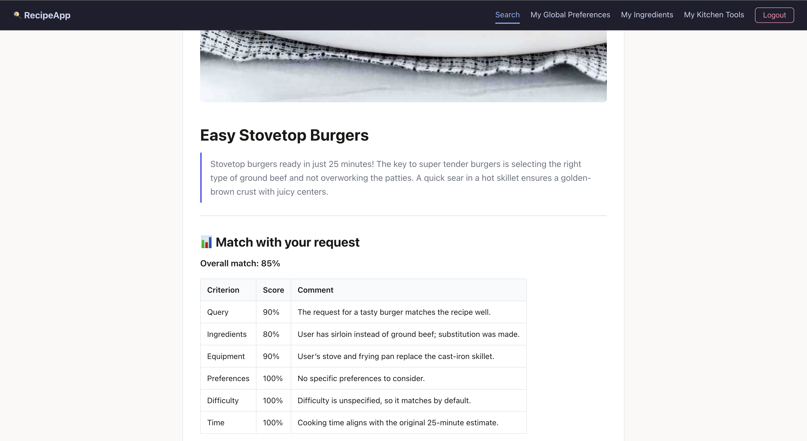

# AiRecipeSearch

A full-stack AI-powered recipe search application.  
Backend: Rust + Actix-web | Frontend: Vue 3 + Vite + TypeScript

## About

Cooking every day is a routine — and deciding *what* to cook is half the effort.  
**AiRecipeSearch** solves that by turning your actual kitchen into a personalized recipe engine.

### How it works

1. **Fill your profile** — add the ingredients you have at home (with fill-level tracking),
   your kitchen appliances, and cookware
2. **Search** — describe what you're in the mood for, or just ask for a suggestion
3. **Get a real recipe** — not AI-generated content, but an actual recipe from a real cook,
   found via Google and fetched directly from the source

### Why real recipes?

Most AI recipe tools just *generate* a recipe on the spot.  
This app takes a different approach:

- 🔍 **Google Search** finds real recipes from real people across the web
- 🌐 **Jina AI** fetches and reads the full recipe pages
- 🤖 **Groq LLM** selects the best match for *your* ingredients and kitchen setup

The AI acts as a **curator, not a chef** — it picks the recipe that fits you best,
presents it in a clean and readable format, and always links back to the **original source**.

> The goal is minimal adaptation, maximum authenticity.

---

### Preview




## Tech Stack

### Backend
- **Language:** Rust (Edition 2024)
- **Web Framework:** Actix-web 4
- **Database:** PostgreSQL via SQLx
- **AI:** Groq API (LLM inference)
- **Search:** SERP API ([Bright Data](https://brightdata.com))
- **Web Scraping:** Jina AI
- **Auth:** JWT (access + refresh tokens) + bcrypt
- **Logging:** Tracing + tracing-subscriber

### Frontend
- **Framework:** Vue 3 (Composition API)
- **Language:** TypeScript
- **Build Tool:** Vite
- **State Management:** Pinia
- **Routing:** Vue Router 5
- **HTTP Client:** Axios
- **Markdown Rendering:** marked

## Features

- AI-powered recipe search with background job processing
- Personalized cooking profile:
  - Global preferences (language, country)
  - Ingredient inventory with fill percentage tracking
  - Kitchen appliance management
  - Cookware management
- CSV import for ingredients (with barcode lookup)
- JWT authentication (access + refresh tokens) with auto-refresh
- Rate limit handling with retry feedback
- Responsive navbar with mobile burger menu

## Getting Started

### Prerequisites

- Rust (latest stable)
- Node.js `^20.19.0` or `>=22.12.0`
- PostgreSQL
- API keys: Groq, SERP, Jina

### Setup

1. **Clone the repo**
   ```bash
   git clone https://github.com/your-username/AiRecipeSearch.git
   cd AiRecipeSearch
   ```

2. **Configure environment**
   ```bash
   cp .env.example .env
   # Fill in the required values
   ```

3. **Build the frontend**
   ```bash
   cd frontend
   npm install
   npm run build
   cd ..
   ```

4. **Run the backend**
   ```bash
   cd backend
   cargo run
   ```

The server starts on `http://0.0.0.0:8080` by default and serves the compiled frontend as static files.

> For frontend development with hot-reload, run `npm run dev` inside `/frontend` separately.  
> The Vite dev server proxies API requests to the backend automatically.

### Docker

```bash
docker-compose up --build
```

## Environment Variables

| Variable | Required | Default | Description |
|---|---|---|---|
| `DATABASE_URL` | ✅ | — | PostgreSQL connection string |
| `JWT_ACCESS_SECRET` | ✅ | — | Secret for access tokens |
| `JWT_REFRESH_SECRET` | ✅ | — | Secret for refresh tokens |
| `GROQ_API_KEY` | ✅ | — | Groq API key |
| `SERP_API_KEY` | ✅ | — | Bright Data SERP API key |
| `JINA_API_KEY` | ✅ | — | Jina AI API key |
| `PORT` | ❌ | `8080` | Server port |
| `DB_POOL_SIZE` | ❌ | `10` | PostgreSQL connection pool size |
| `FRONTEND_DIST` | ❌ | `./frontend/dist` | Path to compiled frontend |
| `APP_BASE_URL` | ❌ | `http://localhost:8080` | Public base URL (used for CORS) |
| `ADMIN_USER_ID` | ❌ | `1` | Admin user ID |
| `MODEL_LITE` | ❌ | `llama3-8b-8192` | Groq lite model name |
| `MODEL_PRO` | ❌ | `deepseek-r1-distill-llama-70b` | Groq pro model name |
| `GROQ_LITE_RPM` | ❌ | `30` | Lite model requests per minute |
| `GROQ_PRO_RPM` | ❌ | `30` | Pro model requests per minute |

## Project Structure

```
├── backend/
│   ├── src/
│   │   ├── main.rs
│   │   ├── config.rs
│   │   ├── error.rs
│   │   ├── routes.rs
│   │   ├── job_store.rs
│   │   ├── db/
│   │   │   ├── mod.rs
│   │   │   ├── users.rs
│   │   │   └── user_cooking_profile.rs
│   │   ├── handlers/
│   │   │   ├── mod.rs
│   │   │   ├── auth.rs
│   │   │   ├── cooking_profile.rs
│   │   │   └── recipes.rs
│   │   ├── middleware/
│   │   │   ├── mod.rs
│   │   │   ├── auth.rs
│   │   │   └── logging.rs
│   │   ├── models/
│   │   │   ├── mod.rs
│   │   │   ├── user.rs
│   │   │   ├── user_cooking_profile.rs
│   │   │   ├── recipe.rs
│   │   │   └── barcode_import.rs
│   │   └── services/
│   │       ├── mod.rs
│   │       ├── auth.rs
│   │       ├── groq.rs
│   │       ├── jina.rs
│   │       ├── serp.rs
│   │       ├── recipe_orchestrator.rs
│   │       └── barcode_import_orchestrator.rs
│   ├── migrations/
│   │   └── 20260301184612_user_cooking_profile.sql
│   └── Cargo.toml
├── frontend/
│   ├── src/
│   │   ├── main.ts
│   │   ├── App.vue
│   │   ├── api/
│   │   │   ├── client.ts
│   │   │   ├── auth.ts
│   │   │   ├── recipes.ts
│   │   │   └── userCookingProfile.ts
│   │   ├── components/
│   │   │   ├── NavBar.vue
│   │   │   ├── RateLimitBanner.vue
│   │   │   └── SearchCostBadge.vue
│   │   ├── stores/
│   │   │   ├── auth.ts
│   │   │   ├── ingredients.ts
│   │   │   └── recipes.ts
│   │   ├── views/
│   │   │   ├── LoginView.vue
│   │   │   ├── SetPasswordView.vue
│   │   │   ├── SearchView.vue
│   │   │   ├── GlobalPreferencesView.vue
│   │   │   ├── IngredientsView.vue
│   │   │   └── KitchenToolsView.vue
│   │   ├── router/
│   │   │   └── index.ts
│   │   └── types/
│   │       └── rateLimit.ts
│   └── package.json
├── docker-compose.yml
└── Dockerfile
```
## Database Schema

PostgreSQL database managed via SQLx migrations.

### Tables

| Table | Description |
|---|---|
| `users` | User accounts (id, name, bcrypt password) |
| `refresh_tokens` | JWT refresh token store with JTI + expiry |
| `password_init_tokens` | One-time invite tokens for password setup |
| `user_global_search_preference` | Per-user language, country & search preferences |
| `user_ingredient` | Ingredient inventory with fill percentage & optional photo |
| `user_kitchen_appliances` | Kitchen appliance list per user |
| `user_cookware` | Cookware list per user |
| `countries` | Reference table — ~115 countries (ISO 3166-1 alpha-2) |
| `languages` | Reference table — ~65 languages (ISO 639-1) |

### Relationships

```
users
 ├── refresh_tokens          (1 : N)
 ├── password_init_tokens    (1 : N)
 ├── user_global_search_preference (1 : 1)
 │    ├── → countries
 │    └── → languages
 ├── user_ingredient         (1 : N)
 ├── user_kitchen_appliances (1 : N)
 └── user_cookware           (1 : N)
```

> Migrations live in `backend/migrations/`. Run automatically on startup via SQLx.

## API Overview

### Auth
| Method | Endpoint | Auth | Description |
|---|---|---|---|
| `POST` | `/api/v1/auth/login` | ❌ | Login |
| `POST` | `/api/v1/auth/refresh` | ❌ | Refresh tokens |
| `POST` | `/api/v1/auth/set-password` | ❌ | Set password via invite token |
| `POST` | `/api/v1/auth/logout` | ✅ | Logout |

### Admin
| Method | Endpoint | Auth | Description |
|---|---|---|---|
| `POST` | `/api/v1/admin/users/:user_id/password-init-link` | ✅ | Generate password setup link for a user |

### Recipes
| Method | Endpoint | Auth | Description |
|---|---|---|---|
| `POST` | `/api/v1/recipes/search` | ✅ | Start AI recipe search job |
| `GET` | `/api/v1/recipes/jobs/:job_id` | ✅ | Poll job status |

### Cooking Profile
| Method | Endpoint | Auth | Description |
|---|---|---|---|
| `GET` | `/api/v1/users/me/cooking-profile` | ✅ | Get full cooking profile |
| `PUT` | `/api/v1/users/me/cooking-profile/global-preferences` | ✅ | Update global preferences |
| `GET` | `/api/v1/users/me/cooking-profile/ingredients` | ✅ | List ingredients |
| `POST` | `/api/v1/users/me/cooking-profile/ingredients` | ✅ | Add ingredient |
| `DELETE` | `/api/v1/users/me/cooking-profile/ingredients/:id` | ✅ | Delete ingredient |
| `PATCH` | `/api/v1/users/me/cooking-profile/ingredients/:id/fill-percentage` | ✅ | Update fill percentage |
| `POST` | `/api/v1/users/me/cooking-profile/ingredients/import` | ✅ | Import ingredients from CSV |
| `GET` | `/api/v1/users/me/cooking-profile/ingredients/import/:import_job_id` | ✅ | Poll CSV import job status |
| `GET` | `/api/v1/users/me/cooking-profile/appliances` | ✅ | List appliances |
| `POST` | `/api/v1/users/me/cooking-profile/appliances` | ✅ | Add appliance |
| `PUT` | `/api/v1/users/me/cooking-profile/appliances/:id` | ✅ | Update appliance |
| `DELETE` | `/api/v1/users/me/cooking-profile/appliances/:id` | ✅ | Delete appliance |
| `GET` | `/api/v1/users/me/cooking-profile/cookware` | ✅ | List cookware |
| `POST` | `/api/v1/users/me/cooking-profile/cookware` | ✅ | Add cookware |
| `PUT` | `/api/v1/users/me/cooking-profile/cookware/:id` | ✅ | Update cookware |
| `DELETE` | `/api/v1/users/me/cooking-profile/cookware/:id` | ✅ | Delete cookware |

### Reference
| Method | Endpoint | Auth | Description |
|---|---|---|---|
| `GET` | `/api/v1/countries` | ❌ | List available countries |
| `GET` | `/api/v1/languages` | ❌ | List available languages |

## License

...